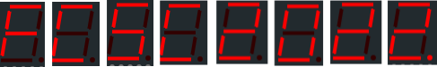

# FCSC 2022 Seven Sins

On vous donne un afficheur sept segments relié à des entrées que vous maîtrisez numérotées de **Bit 0** à **Bit 8** comme indiqué sur l'image **7segments.png**. Il vous est demandé de fournir les 8 suites de 9 bits fournissant la sortie séquentielle montrée sur l'image **fcsc2022.png**.

Note : le flag est **FCSC{XXX}** où **XXX** est la suite de bits retrouvée (donc une suite de charactères ‘0’ et ‘1’).

Exemple : le flag pour la suite de chiffres **789** serait **FCSC{011100100111111110111101110}**.

Quelle est la sortie séquentielle montrée sur l'image :

Auteur : [Cryptanalyse](https://x.com/Cryptanalyse)

Origine : [Seven Sins](https://hackropole.fr/fr/challenges/hardware/fcsc2022-hardware-seven-sins/)

-----------

## Installation manuel
Vous n'utilisez pas l'application **les CTFs de Cyrhades** ? C'est dommage !
Mais voici comment installer ce CTF manuellement :

> git clone https://github.com/Hack-Oeil/fcsc2022-hardware-seven-sins.git

> cd fcsc2022-hardware-seven-sins

-----------

## Sur le site officiel hackropole.fr
> https://hackropole.fr/fr/challenges/hardware/fcsc2022-hardware-seven-sins/